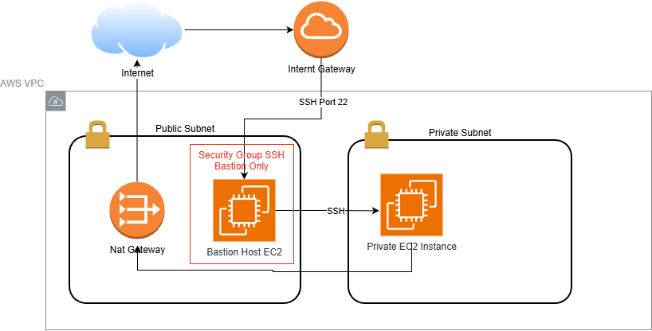
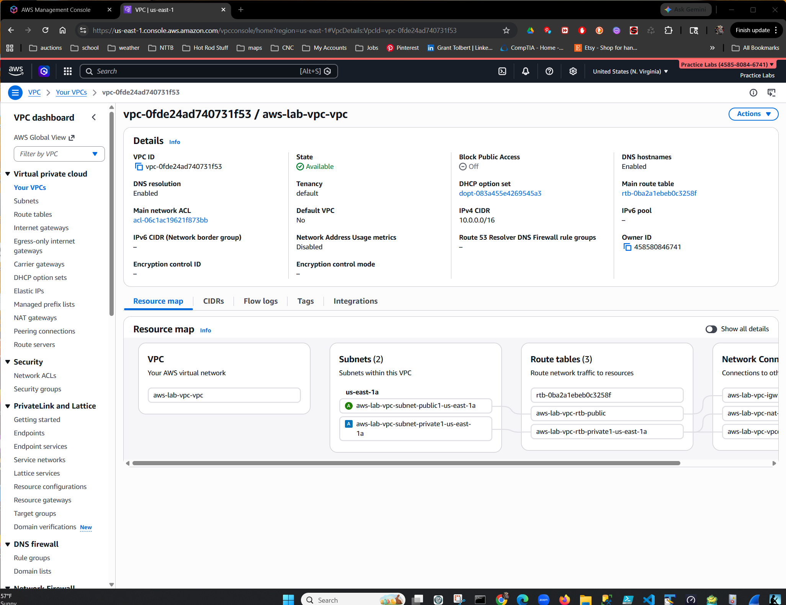
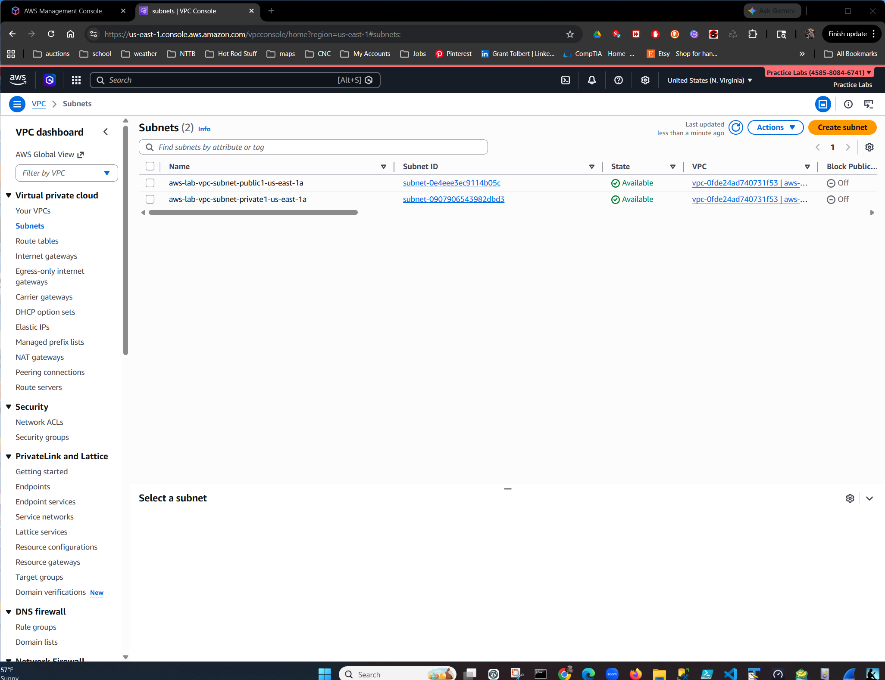
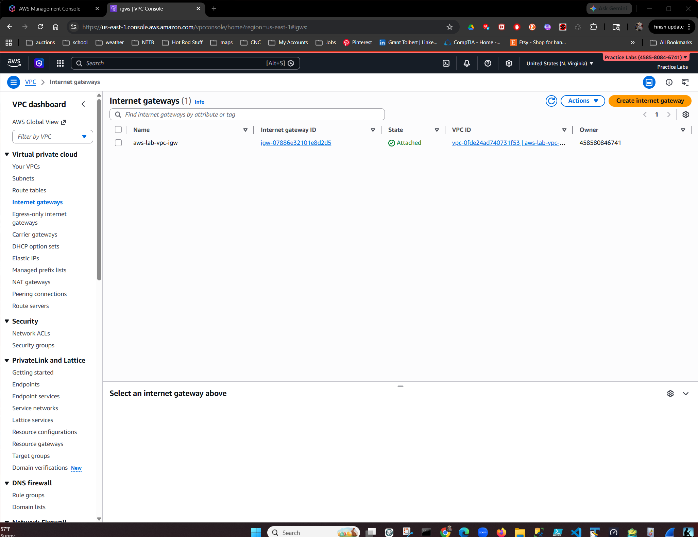
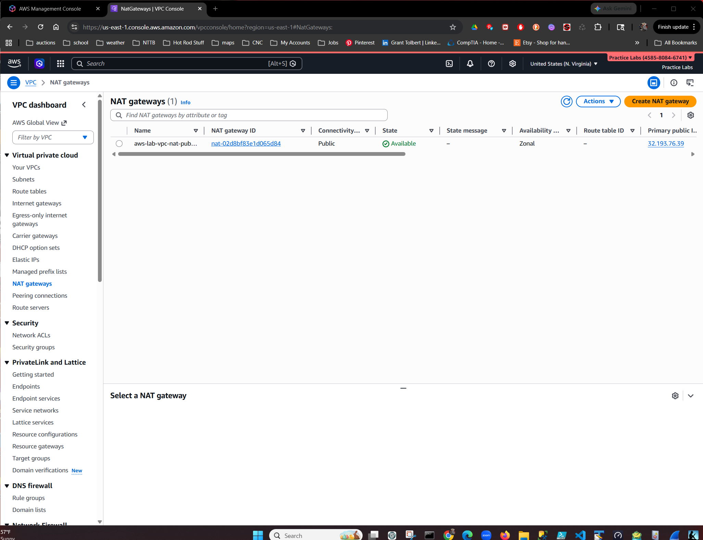
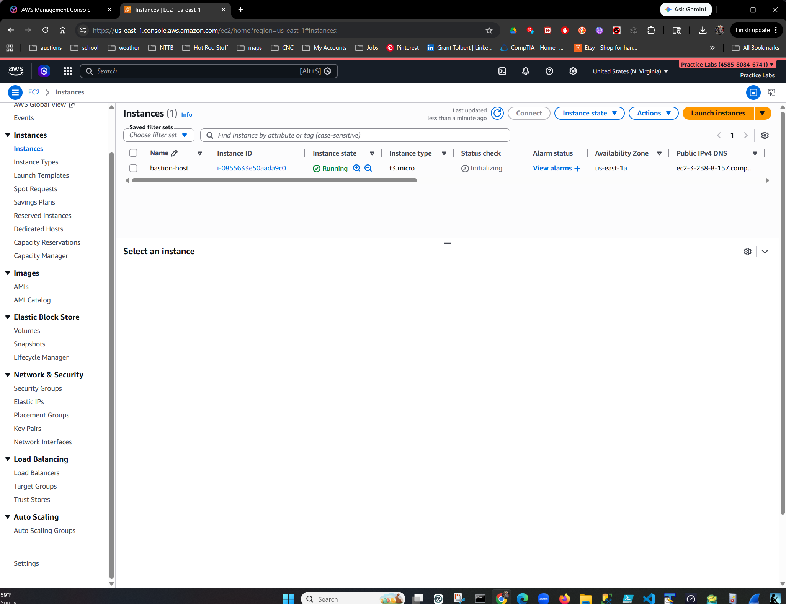
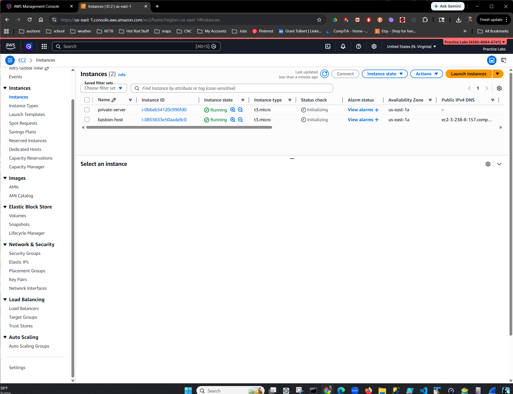
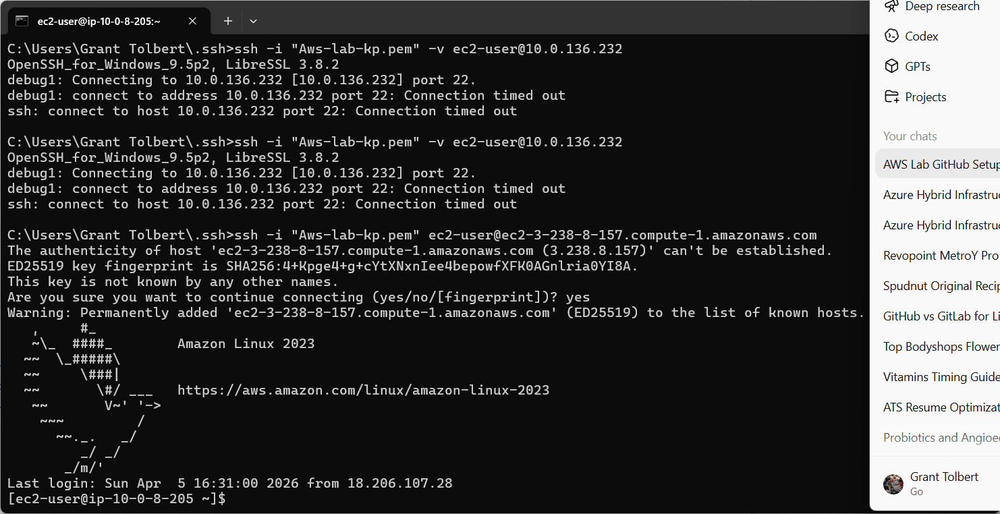
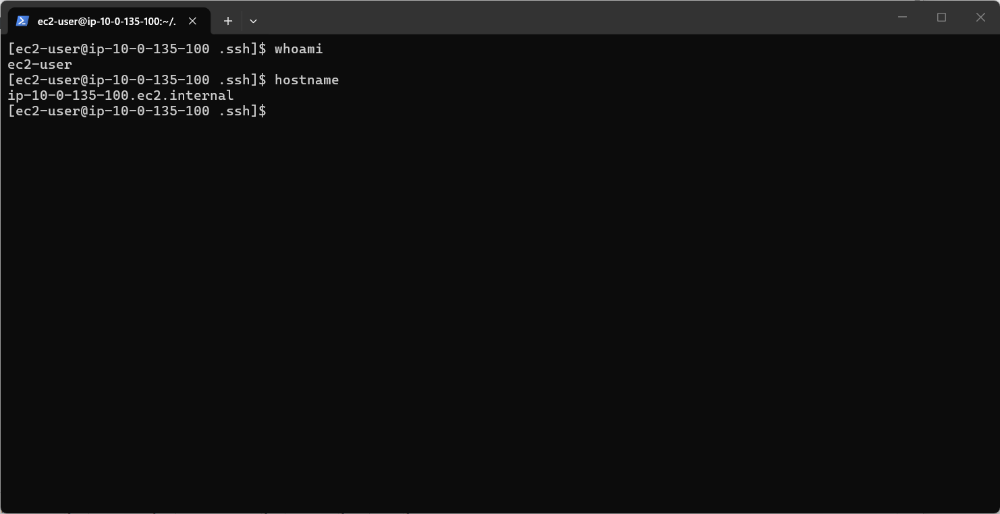

# AWS Secure VPC Infrastructure Lab

This project demonstrates how to build a secure AWS network architecture using a bastion host to access private EC2 instances.

The environment includes a custom VPC, public and private subnets, an Internet Gateway, NAT Gateway, and secure SSH access to a private server through a bastion host.

---

## Architecture



---

## Infrastructure Components

- Custom VPC
- Public Subnet
- Private Subnet
- Internet Gateway
- NAT Gateway
- Bastion Host (EC2)
- Private EC2 Instance
- Security Groups
- SSH Key Authentication

---

## Network Architecture

```
Internet
   │
   │ SSH
   ▼
Bastion Host (Public Subnet)
   │
   │ SSH
   ▼
Private EC2 Instance (Private Subnet)
```

The bastion host acts as a secure entry point to the private network.

---

## Deployment Steps

### 1. Create VPC

- Create a custom VPC
- Configure CIDR block
- Enable DNS hostnames

Screenshot:



---

### 2. Create Public and Private Subnets

Create two subnets:

| Subnet | Purpose |
|------|------|
| Public Subnet | Bastion Host |
| Private Subnet | Internal EC2 instance |

Screenshot:



---

### 3. Configure Internet Gateway

Attach an Internet Gateway to allow external connectivity for the public subnet.

Screenshot:



---

### 4. Configure NAT Gateway

A NAT Gateway allows instances in the private subnet to access the internet for updates without being publicly reachable.

Screenshot:



---

### 5. Deploy Bastion Host

Launch an EC2 instance in the public subnet.

Security Group:

```
Inbound:
SSH (22) → My IP
```

Screenshot:



---

### 6. Deploy Private EC2 Instance

Launch a second EC2 instance in the private subnet.

Security Group:

```
Inbound:
SSH (22) → Bastion Security Group
```

Screenshot:



---

### 7. Connect to Bastion Host

SSH into the bastion host.

```
ssh ec2-user@<bastion-public-ip>
```

Screenshot:



---

### 8. Connect to Private Instance

From the bastion host, connect to the private instance.

```
ssh ec2-user@<private-ip>
```

Screenshot:



---

## Security Design

Key security principles implemented:

- Private subnet isolation
- Bastion host access control
- Security group restrictions
- SSH key authentication
- NAT Gateway for outbound-only internet access

---

## Skills Demonstrated

- AWS VPC Networking
- Subnet Architecture
- Bastion Host Access Pattern
- SSH Key Management
- Security Groups
- NAT Gateway Configuration
- Cloud Infrastructure Design

---

## Future Improvements

Potential enhancements:

- AWS Systems Manager Session Manager
- Infrastructure as Code (Terraform)
- Auto Scaling Bastion
- Load Balancers
- Monitoring with CloudWatch

---

## Author

**Grant Tolbert**

Cloud Infrastructure / Cloud Engineering Portfolio Project